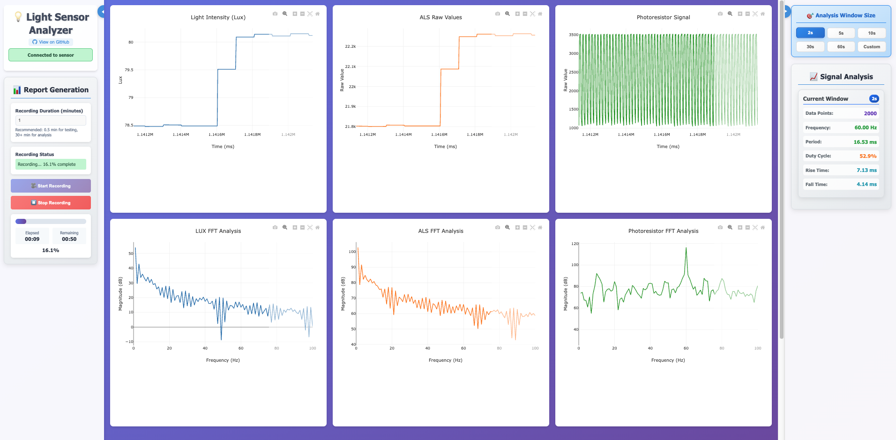

# 💡 Light Sensor Analyzer

A real-time light sensor analysis system that connects to Arduino-based sensor setup, providing live monitoring, signal analysis, and automated PDF report generation.


## 📸 Interface Preview



## ✨ Features

- **Real-Time Monitoring**: Live LUX, ALS, and photoresistor value visualization
- **Signal Analysis**: FFT analysis, dominant frequency detection, duty cycle calculation on photoresistor values
- **Statistical Analysis**: Normalized histograms of rise/fall times, duty cycles, frequencies, and sensor values
- **Automated PDF Reports**: Professional reports with charts, histograms, and statistical analysis
- **Modern Web Interface**: Responsive design with real-time updates
- **Multiple Time Windows**: Short-term (2s), medium-term (10s), and long-term (60s) analysis

## 🔧 Hardware Requirements

### Arduino Setup
- Arduino Uno/Nano or compatible
- VEML6030 Ambient Light Sensor
- Photoresistor (Light-Dependent Resistor)
- 10kΩ resistor for photoresistor pull-down
- USB cable for serial communication

### Sensor Wiring

#### VEML6030 (Digital Light Sensor)
```
Arduino    VEML6030
------     --------
VCC   →    VDD (3.3V)
GND   →    GND
A4    →    SDA (I2C Data)
A5    →    SCL (I2C Clock)
```

#### Photoresistor (Analog Light Sensor)
```
Arduino    Photoresistor Circuit
------     --------------------
A0    →    Photoresistor + 10kΩ pull-down to GND
5V    →    Photoresistor (other terminal)
GND   →    10kΩ resistor (other terminal)
```

**Photoresistor Circuit Configuration:**
- The photoresistor forms a voltage divider with a 10kΩ pull-down resistor
- Higher light intensity → Lower photoresistor resistance → Higher voltage at A0
- Lower light intensity → Higher photoresistor resistance → Lower voltage at A0
- This provides analog light measurement complementing the digital VEML6030 sensor

## 📊 Data Output

The system provides three sensor readings:
- **LUX Values**: Calculated illuminance from VEML6030 (digital sensor)
- **ALS Values**: Raw ambient light sensor data from VEML6030
- **Photoresistor Values**: Analog readings from photoresistor circuit (0-1023)

**Analysis Focus**: The advanced signal analysis (frequency, duty cycle, period, rise/fall times) is performed on photoresistor values, while LUX and ALS provide reference measurements.

## 🚀 Installation

### 1. Clone Repository
```bash
git clone https://github.com/yourusername/LightSensorAnalyzer.git
cd LightSensorAnalyzer
```

### 2. Setup Python Environment
```bash
cd Backend
python -m venv venv

# Activate virtual environment
# Windows: venv\Scripts\activate
# macOS/Linux: source venv/bin/activate

pip install -r requirements.txt
```

### 3. Arduino Setup
1. Connect VEML6030 sensor using I2C wiring diagram above
2. Connect photoresistor with 10kΩ pull-down resistor to analog pin A0
3. Upload Arduino sketch from `Arduino/` directory
4. Verify serial output at 115200 baud shows CSV data: `timestamp,als_raw,white_raw,lux,photoresistor`
5. Note the COM port/device path

### 4. Start Application
```bash
# From Backend directory
python src/main.py
```

Web interface available at: `http://localhost:7001`

## 📱 Usage

1. **Connect**: Ensure Arduino with VEML6030 and photoresistor is connected via USB
2. **Launch**: Run the application and open web interface
3. **Monitor**: View real-time data from both digital (VEML6030) and analog (photoresistor) sensors
4. **Record**: Set duration and click "🎥 Start Recording" for analysis
5. **Analyze**: View real-time charts and automatic PDF report generation with histograms

## 🛠️ Troubleshooting

**"No Arduino found"**
- Check USB connection and COM port
- Verify Arduino sketch is uploaded and running

**No data appearing**
- Check Arduino serial output (115200 baud)
- Verify VEML6030 I2C wiring and power (3.3V)
- Check photoresistor circuit with 10kΩ pull-down resistor
- Ensure expected CSV format: `timestamp,als_raw,white_raw,lux,photoresistor`

**Inconsistent photoresistor readings**
- Verify 10kΩ pull-down resistor is properly connected to GND
- Check photoresistor connection to 5V and A0
- Ensure stable lighting conditions for testing

**Web interface issues**
- Try `http://127.0.0.1:7001`
- Check port 7001 isn't blocked by firewall

## 📁 Project Structure

```
LightSensorAnalyzer/
├── Arduino/           # Arduino sensor sketches
├── Backend/           # Python Flask application
│   ├── src/
│   │   ├── main.py
│   │   └── templates/
│   └── requirements.txt
└── README.md
```

## 📄 License

MIT License - see [LICENSE](LICENSE) file for details.

---

**Made with ❤️ for scientific measurement and analysis** 